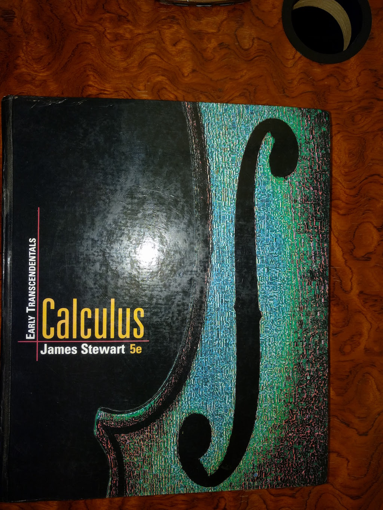
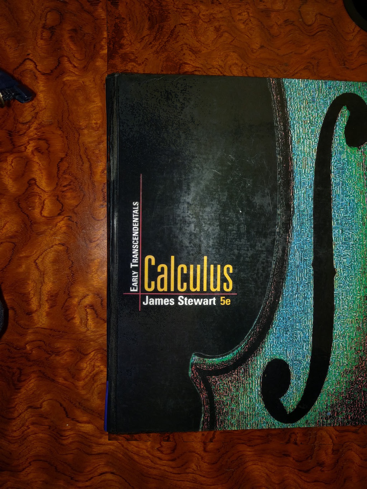
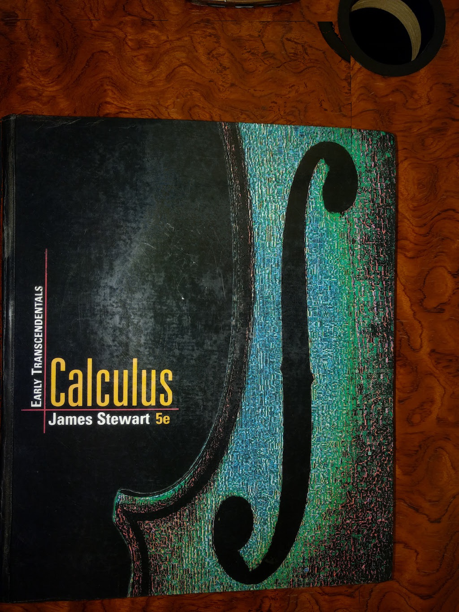
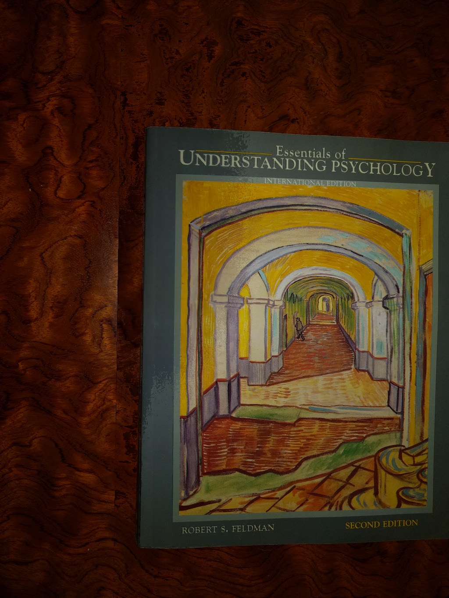
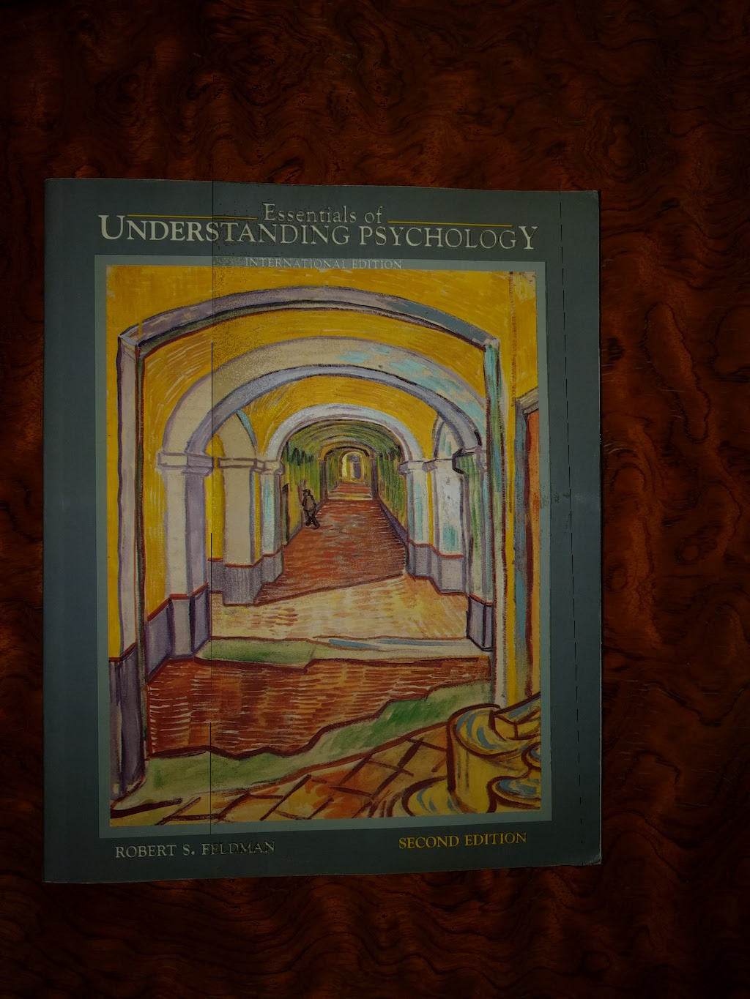
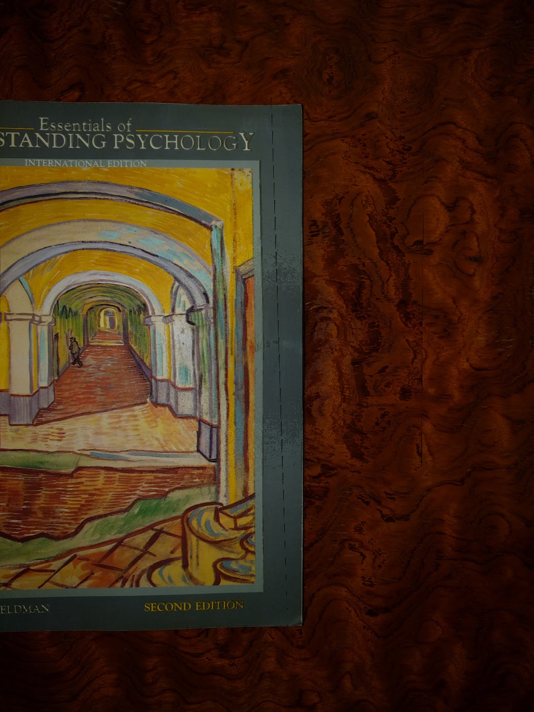

# Specularity removal in multi-viewpoint images

The package is an open source utility to remove specularity in Images that has been captured from multiple viewpoints.

#### Disclaimer
The method uses Homography to find the best pixels available in other viewpoint images. It works only for planar and textured objects.

## Requirements:
- Numpy
- OpenCV

Works with both Python 2.7+ and Python 3+

## Usage
The package is pip installable. The easiest way to install is by using pip.

``` $pip install specularity_removal ```

You can also download the git repo and install by running the below command.

``` $python setup.py ```

To use the specularity removal module in your code, follow the below sample snippet. It accepts an array of image path names. Some constraints are, 

- It should be in same order as the object is in real. 
- All the images should be of equal resolution.
- Images should have enough textures.
- It is faster if you pass the downscaled version of actual images.

```python
import specularity_removal as sp

fnames = [
    'data/pshycology-book-1.jpg',
    'data/pshycology-book-2.jpg',
    'data/pshycology-book-3.jpg'
]
sp.remove_specularity(fnames)
```

## Example 1
#### Using two input images


### Output



## Example 2
#### Using three input images


### Output




